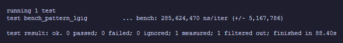
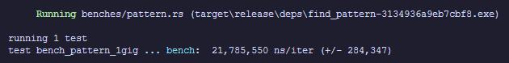
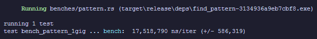

# coolfindpattern

<a href="https://crates.io/crates/coolfindpattern"></img></a>

an updated version of my [findpattern](https://github.com/unknowntrojan/findpattern) crate, this time using modern SIMD.

You have to enable SIMD instruction sets in your .cargo/config.toml. See [config.toml](.cargo/config.toml)

## Old Version (naive)

## New Version (SSE2)

## New Version (AVX2)

